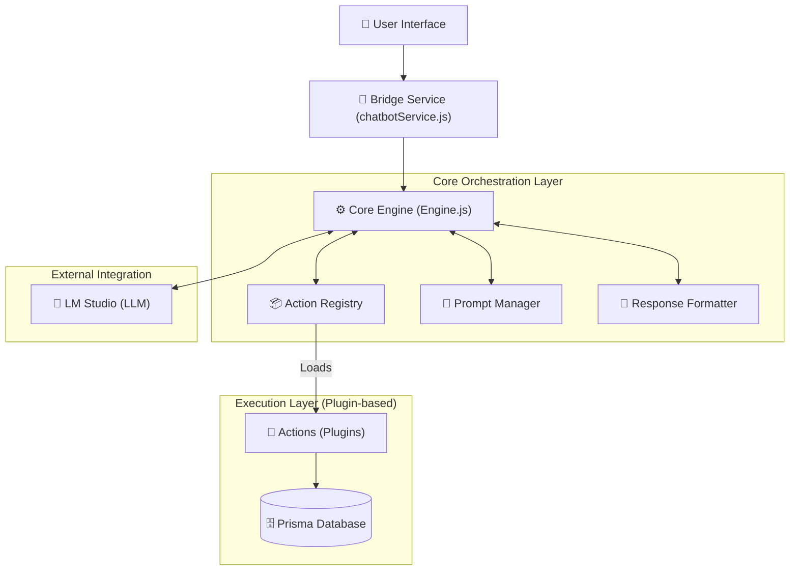

# 🏛️ SportApp AI Agent Engine: Architectural Overview

This document provides a comprehensive high-level design of the refactored SportApp Chatbot system. The architecture has transitioned from a monolithic service to a **Plugin-based Modular Action Pattern**, ensuring massive scalability, maintainability, and enterprise-grade reliability.

## 🌉 The High-Level Architecture

The system is now divided into four primary layers, each with a single, clear responsibility:

---

## 🏗️ Detailed Component Breakdown

### 1. The Action Registry (`src/services/chatbot/core/Registry.js`)
The `Registry` is the **Discovery Engine** of the chatbot. It automatically scans the `actions/` directory for any file ending in `.action.js`. 
- **Auto-Discovery**: Simply dropping a new file into the folder registers it as a tool for the AI.
- **Role-Based Filtering**: The Registry ensures that the AI only sees tools appropriate for the current user's role (CUSTOMER, OWNER, or ADMIN).
- **Execution Routing**: It maps tool names directly to their isolated logic files.

### 2. The Plugin-based Actions (`src/services/chatbot/actions/`)
Each feature (e.g., Booking, Search, Summary) is now an independent **Action**. Every action exports:
- **`definition`**: The JSON schema that tells the AI *how* to use the tool.
- **`roles`**: An array of permitted roles.
- **`execute`**: The isolated logic, injected with its necessary dependencies (Args, Prisma, User context).

### 3. The Core Engine (`src/services/chatbot/core/Engine.js`)
The **Orchestrator** that manages the dialogue loop:
1. Receives the user message and history.
2. Resolves geographical context (GPS).
3. Requests a system-specific prompt from the `PromptManager`.
4. Communicates with LM Studio (LLM).
5. Processes function calls and routes them via the `Registry`.
6. Summarizes results via the `Formatter`.

### 4. The Prompt Manager (`src/services/chatbot/core/PromptManager.js`)
Centralizes all **Business Intelligence Rules**. Instead of hardcoded strings in logic, the Prompt Manager builds dynamic instructions including:
- Current date/time context.
- User profile & Role specifics.
- Strict operational rules (e.g., Rule 16 for payments, Rule 11 for hallucination prevention).

---

## 📈 Scalability & Future-Proofing

> [!TIP]
> **To add a new feature (e.g., "Check Weather"):**
> 1. Create `src/services/chatbot/actions/check_weather.action.js`.
> 2. Define the schema and the OpenWeatherMap API call inside it.
> 3. That's it. The AI will immediately "learn" this new capability.

## 🛡️ Security & Role-Based Access (RBAC)
The architecture enforces **Strict Separation of Concerns**. 
- **Customer Actions**: Optimized for searching and booking.
- **Owner Actions**: Limited to their own venues, revenue summaries, and report generation.
- **Admin Actions**: Full platform visibility and sensitive statistical exports.
- **Enforcement**: RBAC is checked at the **Registry level**, meaning the AI *never even sees* the description of a tool it isn't allowed to call.

---

> [!IMPORTANT]
> This refactor ensures that as SportApp grows to support 100+ different sports and advanced management features, the AI Agent remains fast, predictable, and robust.
