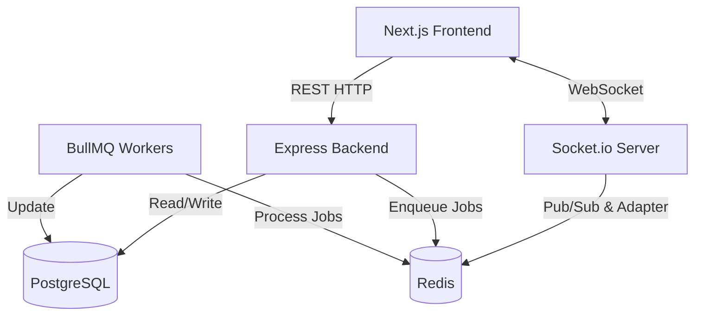

# System Architecture

SportApp uses a modern, decoupled client-server architecture, leveraging real-time capabilities to provide an interactive user experience.

## Tech Stack Overview

### Frontend
- **Framework:** [Next.js](https://nextjs.org/) (Using the App Router `src/app`).
- **Styling:** Tailwind CSS and vanilla CSS modules.
- **State & Data Fetching:** React Hooks, Axios.
- **Realtime:** `socket.io-client`.
- **Maps:** `react-leaflet` for interactive venue location picking and viewing.

### Backend
- **Runtime Environment:** Node.js.
- **Framework:** Express.js for REST APIs.
- **Database ORM:** [Prisma](https://www.prisma.io/).
- **Database:** PostgreSQL.
- **Realtime & Background Jobs:** `socket.io` for WebSockets, `redis` + `socket.io-redis-adapter` for scaling WebSockets, and `bullmq` for background queues/jobs.

## High-Level Architecture Diagram

## Folder Structure

### `frontend/`
- `src/app/`: Next.js pages and routing.
- `src/components/`: Reusable React components (e.g., `Navbar.js`, `VenueCard.js`).
- `src/lib/`: Utility functions, auth helpers.

### `backend/`
- `src/server.js`: Entry point.
- `src/routes/`: Express API route definitions.
- `src/controllers/`: Request handling logic.
- `src/services/`: Core business logic (e.g., `bookingService.js`, `reportService.js`).
- `src/jobs/`: Background job processors (e.g., `queue.js`).
- `prisma/`: Database schema (`schema.prisma`) and seed scripts.
